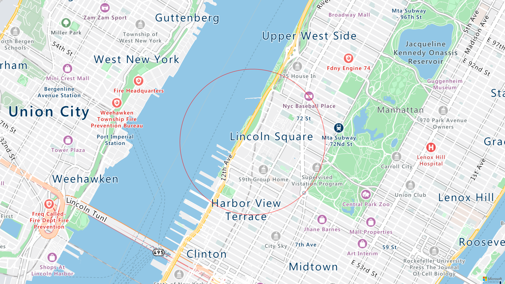

# func-mapspoc
This Azure Function proof-of-concept example takes a mailing address as query string argument (address) and produces a map image with a circle around the center point using Azure Maps. 

This Function example does the following:

1. Triggered with HTTP get/post; accepts single argument (address) via query string or post body
2. Validates input 
3. Uses the Azure Maps API to retrieve latitude and longitude for provided address
4. Renders a map image centered on the provided lat/long with a circle path drawn around that point 
5. Outputs the rendered image to an Azure Blob Storage container using the Azure Storage Blob client library

**Sample Output**

**Requirements**
- Azure Functions Tools 
- Azure Function App
- Azure Maps account 
- Azure Storage account 

**App Settings**
AzureMapsSubscriptionKey - Subscription key for Azure Maps account
AzureMapsSubscriptionKey - Client ID for Azure Maps account 
StorageConnectionString - Azure Storage connection string
ContainerName - name for blob container for output

**Resources** 
- [Quickstart: Create a function in Azure with Python using Visual Studio Code](https://docs.microsoft.com/en-us/azure/azure-functions/create-first-function-vs-code-python)
- [Azure Maps - Render Service](https://docs.microsoft.com/en-us/rest/api/maps/render)
- [Azure Maps - Address Search](https://docs.microsoft.com/en-us/rest/api/maps/search/getsearchaddress)

